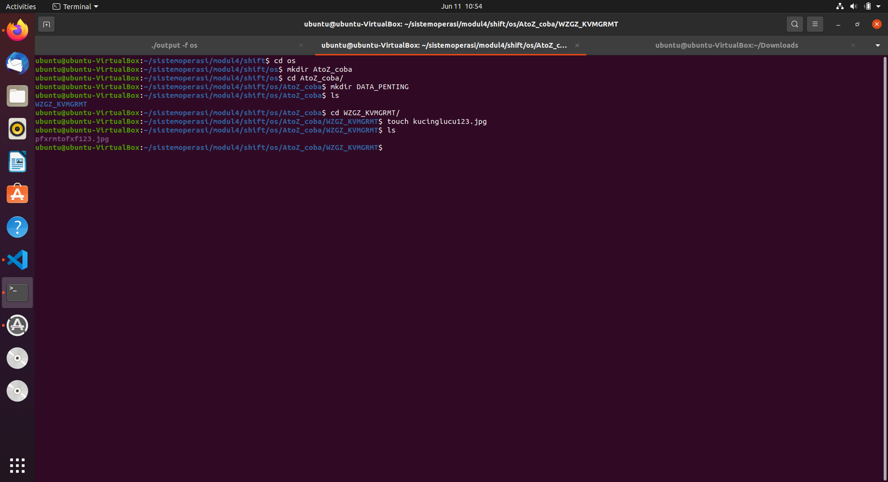
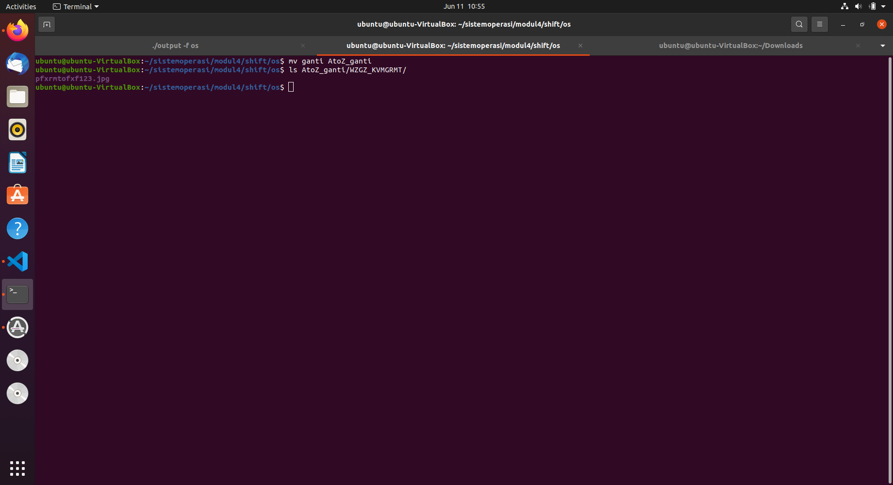
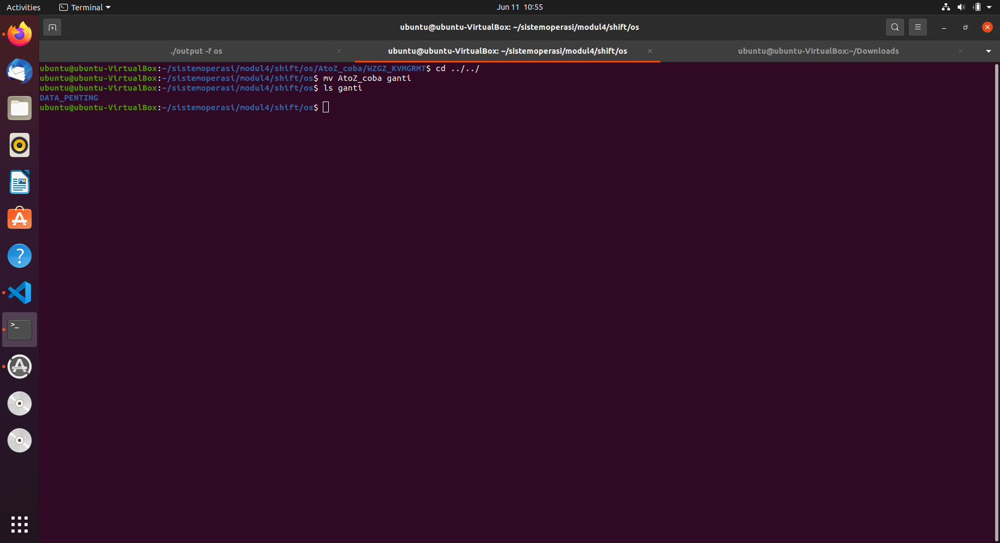
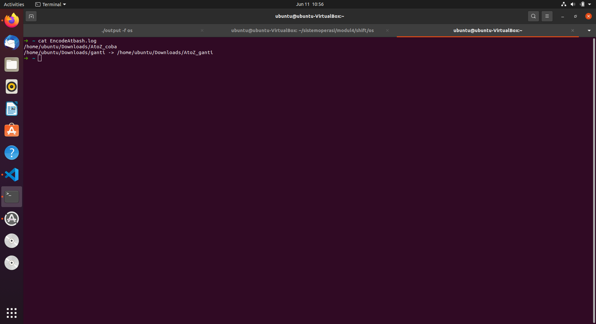
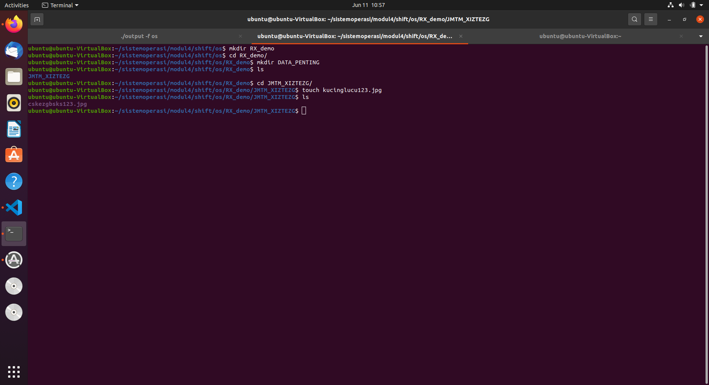
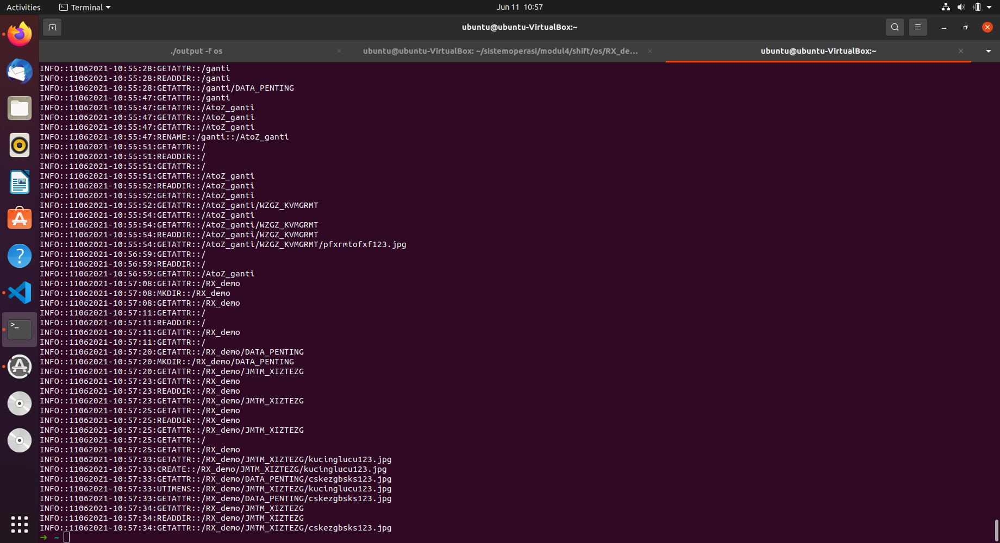

# soal-shift-sisop-modul-4-IT10-2021
## Anggota Kelompok
- Naufal Aprilian Marsa Mahendra    05311940000007
- Dian Arofati Nur Zamzamy          05311940000011
- Christopher Benedict              05311840000024

# Pendahuluan
Sebelum pengerjaan soal pada Modul 4 ini. Hal pertama yang dilakukan adalah kita membuat FUSE filesystem yang berjalan seperti file system biasa dengan mengimplementasikan beberapa system-call sebagai berikut

```
static struct fuse_operations xmp_oper = {

	.getattr = xmp_getattr,
	.readdir = xmp_readdir,
	.read = xmp_read,
	.mkdir = xmp_mkdir,
	.unlink = xmp_unlink,
	.rmdir = xmp_rmdir,
	.rename = xmp_rename,
	.open = xmp_open,
	.create = xmp_create,
	.utimens = xmp_utimens

};

int main(int argc, char *argv[])
{
	umask(0);
	return fuse_main(argc, argv, &xmp_oper, NULL);
}
```
Seluruh system-call tersebut pada dasarnya hanya memanggil system-call linux dengan mengganti path yang diinputkan pada system-call tersebut menjadi path pada mount-pointnya, yaitu pada variable dirpath.
- xmp_getattr(): untuk mendapatkan stat dari path yang diinputkan.
- xmp_read(): untuk membaca isi dari path.
- xmp_mkdir(): untuk membuat direktori pada path.
- xmp_unlink(): untuk menghapus sebuah file pada path.
- xmp_rmdir(): untuk menghapus directory pada path.
- xmp_rename(): untuk me-rename dari path awal menjadi path tujuan.
- xmp_open(): untuk meng-open (membuka) path.
- xmp_create(): untuk membuat path berdasarkan mode yang diinputkan.
- xmp_utimens(): untuk mengubah status time dari path.
Berikut adalah pendefinisian dirpath yang menjadi mount point-nya 
```
static const char *dirpath = "/home/ubuntu/Downloads";
```
# Soal 1
## Deskripsi
Di suatu jurusan, terdapat admin lab baru yang super duper gabut, ia bernama Sin. Sin baru menjadi admin di lab tersebut selama 1 bulan. Selama sebulan tersebut ia bertemu orang-orang hebat di lab tersebut, salah satunya yaitu Sei. Sei dan Sin akhirnya berteman baik. Karena belakangan ini sedang ramai tentang kasus keamanan data, mereka berniat membuat filesystem dengan metode encode yang mutakhir. Berikut adalah filesystem rancangan Sin dan Sei :
```
NOTE : 
Semua file yang berada pada direktori harus ter-encode menggunakan Atbash cipher(mirror).
Misalkan terdapat file bernama kucinglucu123.jpg pada direktori DATA_PENTING
“AtoZ_folder/DATA_PENTING/kucinglucu123.jpg” → “AtoZ_folder/WZGZ_KVMGRMT/pfxrmtofxf123.jpg”
Note : filesystem berfungsi normal layaknya linux pada umumnya, Mount source (root) filesystem adalah directory /home/[USER]/Downloads, dalam penamaan file ‘/’ diabaikan, dan ekstensi tidak perlu di-encode.
Referensi : https://www.dcode.fr/atbash-cipher
```
# Penyelesaian
Dalam pengerjaan nomor 1 kami menggunakan 3 fungsi yang kami definisikan yang digunakan dalam setiap system-call. Fungsi tersebut adalah encrypt1() dan decypt1() dan atbash().

- encrypt1()
Pemanggilan ini difungsikan untuk mengubah path yang dikirimkan ke fungsi encrypt1() dilakukan encrypt keseluruhan untuk nama pathnya. Fungsi ini akan memanggil fungsi atbash() dengan mengirimkan setiap karakter pathnya untuk dilakukan enkripsi
```
void encript1(char *pathname)
{
	if (!strcmp(pathname, "."))
	{
		return;
	}
	else if (!strcmp(pathname, ".."))
	{
		return;
	}

	int size = strlen(pathname);
	char tmp[size];

	for (int i = 0; i < size; i++)
	{
		tmp[i] = pathname[i];
	}

	// ekstensi
	char *ekstensi = strrchr(pathname, '.');
	if (ekstensi == NULL)
	{
		ekstensi = "";
	}
	// DEBUG
	printf("\nEKSTENSI %s", ekstensi);
	int b = strlen(ekstensi);
	int i = 0;
	while (i < strlen(pathname) - b)
	{
		atbash(&tmp[i], &pathname[i]);
		i++;
	}
}
```

- decrypt1()
Pemanggilan ini difungsikan untuk mengubah path yang dikirimkan ke fungsi decrypt1() dilakukan decrypt untuk nama path yang dikirimkan kecuali kata AtoZ_{.*}/. Fungsi ini akan memanggil fungsi atbash() dengan mengirimkan setiap karakter pathnya untuk dilakukan dekripsi.
```
void decript1(char *pathname)
{
	if (!strcmp(pathname, "."))
	{
		return;
	}
	else if (!strcmp(pathname, ".."))
	{
		return;
	}
	int size = strlen(pathname);
	char temp[size];

	for (int i = 0; i < size; i++)
	{
		temp[i] = pathname[i];
	}

	int flag1 = 0, flag2 = 0;
	if ((pathname[0] == 'A' && pathname[1] == 't' && pathname[2] == 'o' && pathname[3] == 'Z' && pathname[4] == '_') || (pathname[0] == 'R' && pathname[1] == 'X' && pathname[2] == '_'))
	{
		flag1 = 1, flag2 = 1;
	}
	// ekstensi
	char *ekstensi = strrchr(pathname, '.');
	if (ekstensi == NULL)
	{
		ekstensi = "";
	}
	// DEBUG
	printf("\nEKSTENSI %s", ekstensi);
	int b = strlen(ekstensi);
	int i = 0;
	// melakukan decrypt setelah AtoZ_{.*}/
	while (i < strlen(pathname) - b)
	{
		if (pathname[i] == '/')
		{
			flag1 = 0;
		}
		if ((flag1 != 1 && pathname[i] != '/') && flag2 == 1)
		{

			atbash(&temp[i], &pathname[i]);
		}
		i++;
	}
}
```
- atbash
Pemanggilan fungsi ini ditujukan untuk melakukan enkripsi ataupun dekripsi setiap karakter yang dikirimkan menggunakan metode atbash. Atbash adalah cipher substitusi  sederhana  dengan  cara  membalikkan  alfabet sehingga setiap huruf dipetakan ke huruf di posisi yang sama kebalikan dari abjad. 
```
void atbash(char *new, char *enc)
{
	if (!((*new >= 0 && *new < 65) || (*new > 90 && *new < 97) || (*new > 122 && *new <= 127)))
	{
		if (*new >= 'A' && *new <= 'Z')
		{
			*enc = 'Z' + 'A' - *new;
		}

		if (*new >= 'a' && *new <= 'z')
		{
			*enc = 'z' + 'a' - *new;
		}
	}

	if (((*new >= 0 && *new < 65) || (*new > 90 && *new < 97) || (*new > 122 && *new <= 127)))
	{
		*enc = *new;
	}
}
```
Disini terapat system-call yang akan sering terpanggil diantaranya adalah xmp_getattr() dan xmp_readdir(). xmp_getattr() digunakan untuk mendapatkan stat dari path yang diinputkan. Sehingga akan sering digunakan. xmp_readdir() digunakan untuk membaca nama direktori dan file yang ada di path. Contohnya kita melakukan listing direktori maka akan memanggil xmp_getattr() dan xmp_readdir()
- xmp_getattr()
Disini untuk membenarkan path ke mount-point dirpath kita dilakukan beberapa hal. Ketika dalam sebuah path yang dikirimkan terdapat kata Ato_Z maka akan dicek terlebih dahulu apakah getattr ini dipanggil karena system-call touch atau mkdir. Jika iya maka akan ada perlakuan khusus dimana filename nya akan disimpan menggunakan strtok untuk mendapatkan kata terakhir dengan delimitter "/" dan dilakukan replace terhadap filename yang sudah melalui fungsi decrypt1(). Jika bukan dari mkdir atau touch maka akan dilakukan pemanggilan decript1() untuk pathnya.
```
static int xmp_getattr(const char *path, struct stat *stbuf)
{
	int res;
	char fpath[1000];
	char desc[1000];
	// log
	strcpy(desc, path);
	// fpath
	strcpy(fpath, dirpath);
	strcat(fpath, path);
	sprintf(fpath, "%s%s", dirpath, path);
	// debug
	printf("\nGETATTR %s ->", fpath);
	if (strstr(path, "AtoZ_") != NULL)
	{
		if (ismkdir)
		{

			int lenfilename;

			char temp[500];
			char *temp2[500];

			char *slash;
			int x = 0;
			strcpy(temp, fpath);

			slash = strtok(temp, "/");
			while (slash != NULL)
			{
				temp2[x] = slash;
				x++;
				slash = strtok(NULL, "/");
			}

			char *filename = temp2[x - 1];
			lenfilename = strlen(filename);
			if (!strstr(filename, "AtoZ_"))
			{
				encript1(filename);
			}

			strcpy(fpath, dirpath);

			strncat(fpath, path, strlen(path) - lenfilename);
			strcat(fpath, filename);
			ismkdir = 0;
		}
		else if (istouch)
		{

			int lenfilename;

			char temp[500];
			char *temp2[500];

			char *slash;
			int x = 0;
			strcpy(temp, fpath);

			slash = strtok(temp, "/");
			while (slash != NULL)
			{
				temp2[x] = slash;
				x++;
				slash = strtok(NULL, "/");
			}

			char *filename = temp2[x - 1];
			lenfilename = strlen(filename);
			encript1(filename);
			strcpy(fpath, dirpath);
			strncat(fpath, path, strlen(path) - lenfilename);
			strcat(fpath, filename);
			istouch = 0;
		}
		else if (istouch2)
		{
			int lenfilename;

			char temp[500];
			char *temp2[500];

			char *slash;
			int x = 0;
			strcpy(temp, fpath);

			slash = strtok(temp, "/");
			while (slash != NULL)
			{
				temp2[x] = slash;
				x++;
				slash = strtok(NULL, "/");
			}

			char *filename = temp2[x - 1];
			lenfilename = strlen(filename);
			encript1(filename);
			strcpy(fpath, dirpath);
			strncat(fpath, path, strlen(path) - lenfilename);
			strcat(fpath, filename);

			istouch2 = 0;
		}
		else
		{
			char *encv1 = strstr(path, "AtoZ_");

			decript1(encv1);
			// debug
			// printf("%s \n", encv1);
			strcpy(fpath, dirpath);
			strcat(fpath, "/");
			strcat(fpath, encv1);
			// sprintf(fpath, "%s/%s", dirpath, encv1);
		}
	}
	else if (strstr(path, "RX_") != NULL)
	{

		...
	}
	// debug
	printf("\nGETATTR %s ->", fpath);
	res = lstat(fpath, stbuf);
	logFile("INFO", "GETATTR", desc);
	printf(" %s\n", fpath);
	if (res == -1)
		return -errno;

	return 0;
}
```
- xmp_readdir()
Disini untuk membenarkan path ke mount-point dirpath kita dilakukan beberapa hal. Ketika dalam sebuah path yang dikirimkan terdapat kata Ato_Z maka decrypt1() untuk pathnya. Setelah itu untuk d->name kita lakukan enkripsi sehingga ketika user melihat dari FUSE maka akan terlihat terenkripsi
```
//Read directory
static int xmp_readdir(const char *path, void *buf, fuse_fill_dir_t filler,
					   off_t offset, struct fuse_file_info *fi)
{
	char fpath[1000];
	char desc[1000];
	// log
	strcpy(desc, path);
	// fpath
	strcpy(fpath, dirpath);
	strcat(fpath, path);
	// debug
	printf("\nREADDIR %s ->", fpath);
	// log
	logFile("INFO", "READDIR", desc);
	if (strcmp(path, "/") == 0)
	{
		path = dirpath;
		strcpy(fpath, path);
	}
	else if (strstr(path, "AtoZ_") != NULL)
	{
		char *encv1 = strstr(path, "AtoZ_");
		decript1(encv1);

		strcpy(fpath, dirpath);
		strcat(fpath, "/");
		strcat(fpath, encv1);
	}
	else if (strstr(path, "RX_") != NULL)
	{
		char *pathencv2 = strstr(path, "RX_");
		decript2(pathencv2);
		decript1(pathencv2);
		strcpy(fpath, dirpath);
		strcat(fpath, "/");
		strcat(fpath, pathencv2);
	}
	//debug
	printf("%s\n", fpath);

	DIR *dp;
	struct dirent *de;
	(void)offset;
	(void)fi;
	dp = opendir(fpath);
	if (dp == NULL)
		return -errno;
	while ((de = readdir(dp)) != NULL)
	{
		struct stat st;
		memset(&st, 0, sizeof(st));
		st.st_ino = de->d_ino;
		st.st_mode = de->d_type << 12;

		// debug
		printf("\n READDIR NAMA FILE %s -> ", de->d_name);

		if (strstr(path, "AtoZ_") != NULL)
		{
			encript1(de->d_name);
		}
		else if (strstr(path, "RX_") != NULL)
		{
			encript1(de->d_name);
			encript2(de->d_name);
		}
		// DEBUG
		printf(" %s\n", de->d_name);

		if (filler(buf, de->d_name, &st, 0))
			break;
	}
	closedir(dp);
	return 0;
}
```
# Soal 1a
## Deskripsi
Jika sebuah direktori dibuat dengan awalan “AtoZ_”, maka direktori tersebut akan menjadi direktori ter-encode.
## Penyelesaian
Disini perlu system-call xmp_mkdir(). Hal pertama yang dilakukan adalah mengambil nama file nya dari path terlebih dahaulu. Setelah itu dilakukan decrypt1() jika terdapat kata AtoZ_ pada path. Setelah itu tinggal di append hasil dari decrypt1() dengan nama file yang kita ambil dan dilakukan mkdir pada mount-point dirpath kita. Jika tidak ada kata AtoZ_ pada pathnya maka tida akan adal pemanggilan fungsi decrypt1().
```
static int xmp_mkdir(const char *path, mode_t mode)
{
	//logsys(0, "MKDIR", path);
	int res;
	char fpath[1000], desc[1000];
	sprintf(fpath, "%s%s", dirpath, path);
	strcpy(desc, path);

	char filename[500];
	int lenfilename;

	char temp[500];
	char *temp2[500];

	char *slash;
	int x = 0;
	strcpy(temp, fpath);

	slash = strtok(temp, "/");
	while (slash != NULL)
	{
		temp2[x] = slash;
		x++;
		slash = strtok(NULL, "/");
	}

	strcpy(filename, temp2[x - 1]);
	lenfilename = strlen(filename);
	// strncpy(fullpath,temp3,lenfullpath-lenfilename);
	// strcat(fullpath,filename);

	if (strcmp(path, "/") == 0)
	{
		path = dirpath;
		strcpy(fpath, path);
		// sprintf(fpath, "%s", path);
	}
	else if (strstr(path, "AtoZ_") != NULL)
	{
		char log[1000];
		strcpy(log, dirpath);
		strcat(log, path);
		char *temppath = strstr(path, "AtoZ_");
		if (strstr(temppath, "/") == NULL)
		{
			logEncodeAtbash(log);
		}
		char *encv1 = strstr(path, "AtoZ_");
		decript1(encv1);
		strcpy(fpath, dirpath);
		strcat(fpath, "/");
		strncat(fpath, encv1, strlen(encv1) - lenfilename);
		strcat(fpath, filename);
	}
	else if (strstr(path, "RX_") != NULL)
	{
		// atbash +ROT13
		char *encv2 = strstr(path, "RX_");
		decript2(encv2);
		decript1(encv2);
		strcpy(fpath, dirpath);
		strcat(fpath, "/");
		strncat(fpath, encv2, strlen(encv2) - lenfilename);
		strcat(fpath, filename);
	}
	printf("\nMKDIR -> %s\n", fpath);
	printf("\nMKDIR -> %s\n", fpath);
	printf("\nMKDIR -> %s\n", fpath);

	res = mkdir(fpath, mode);
	logFile("INFO", "MKDIR", desc);
	ismkdir = 1;
	if (res == -1)
	{
		ismkdir = 0;
		return -errno;
	}
	return 0;
}

```

# Soal 1b
## Deskripsi
Jika sebuah direktori di-rename dengan awalan “AtoZ_”, maka direktori tersebut akan menjadi direktori ter-encode.
## Penyelesaian
Dalam melakukan rename maka akan ada pemanggilan system-call xmp_rename yang memiliki argumen diantaranya path from dan path to. Disini akan dicek jika pada path to terdapat kata AtoZ_ didalamnya maka hal yang dilakukan adalah mendapatkan namafile nya yang asli terlebih dahulu menggunakan strtok(). Setelah itu path to nya akan dilakukan decrypt() setelah itu dilakukan replace untuk nama file dengan nama file aslinya.
```
static int xmp_rename(const char *from, const char *to)
{
	int res;
	char from1[1000], to1[1000], desc[1000];
	char *ffrom1 = strstr(from, "AtoZ_"), *fto1 = strstr(to, "AtoZ_");

	// from di decrypt, to decrypt trus nama file encrypt
	// logfile
	strcpy(desc, from);
	strcat(desc, "::");
	strcat(desc, to);
	// from
	strcpy(from1, dirpath);
	strcat(from1, from);
	// to
	strcpy(to1, dirpath);
	strcat(to1, to);
	// DEBUG
	printf("\nRENAME %s ->  %s\n", from1, to1);
	if (ffrom1 != NULL && fto1 != NULL)
	{
		char filename[500];
		int lenfilename;

		char temp[500];
		char *temp2[500];

		char *slash;
		int x = 0;
		strcpy(temp, to1);

		slash = strtok(temp, "/");
		while (slash != NULL)
		{
			temp2[x] = slash;
			x++;
			slash = strtok(NULL, "/");
		}

		strcpy(filename, temp2[x - 1]);
		lenfilename = strlen(filename);
		char *encv1 = strstr(to, "AtoZ_");
		decript1(encv1);
		// strlen(encv1);
		strcpy(to1, dirpath);
		strcat(to1, "/");
		strncat(to1, encv1, strlen(to) - lenfilename - 1);
		strcat(to1, filename);
		decript1(ffrom1);
		sprintf(from1, "%s/%s", dirpath, ffrom1);
	}
	else if (fto1 != NULL && ffrom1 == NULL)
	{
		char filename[500];
		int lenfilename;

		char temp[500];
		char *temp2[500];

		char *slash;
		int x = 0;
		strcpy(temp, fto1);

		slash = strtok(temp, "/");
		while (slash != NULL)
		{
			temp2[x] = slash;
			x++;
			slash = strtok(NULL, "/");
		}
		strcpy(filename, temp2[x - 1]);
		lenfilename = strlen(filename);
		decript1(fto1);

		// strlen(encv1);
		strcpy(to1, dirpath);
		strcat(to1, "/");
		strncat(to1, fto1, strlen(fto1) - lenfilename);
		strcat(to1, filename);
	}
	// DEBUG
	printf("\nRENAME %s ->  %s\n", from1, to1);

	res = rename(from1, to1);

	// logfile
	char *tempto = strstr(to, "AtoZ_");
	if (tempto != NULL && !strstr(tempto, "/"))
	{
		char log[1000];
		strcpy(log, from1);
		strcat(log, " -> ");
		strcat(log, to1);
		logEncodeAtbash(log);
	}
	logFile("INFO", "RENAME", desc);
	if (res == -1)
		return -errno;
	return 0;
}
```
# Soal 1c
## Deskripsi
Apabila direktori yang terenkripsi di-rename menjadi tidak ter-encode, maka isi direktori tersebut akan terdecode.
## Penyelesaian
disini sebenarnya tinggal memanggil system-call xmp_rename dan melakukan rename dari from ke to . Untuk source code bisa dilihat di 1b
# Soal 1d
## Deskripsi
Setiap pembuatan direktori ter-encode (mkdir atau rename) akan tercatat ke sebuah log. Format : /home/[USER]/Downloads/[Nama Direktori] → /home/[USER]/Downloads/AtoZ_[Nama Direktori]
## Penyelesaian
Disini kami membuat sebuah fungsi logEncodeAtbash() untuk melakukan logging terhadap pembuatan direktori ter-encode dari mkdir ataupun rename. Fungsi ini akan membuat sebuah file bernama EncodeAtbash debgan mode append. Dimana isinya adalah path mkdir ataupun rename ketika membuat sebuah direktori terencode.
```
void logEncodeAtbash(char *desc)
{
	FILE *f = fopen("/home/ubuntu/EncodeAtbash.log", "a");
	fprintf(f, "%s\n", desc);

	fclose(f);
}
```
# Soal 1e
## Deskripsi
Metode encode pada suatu direktori juga berlaku terhadap direktori yang ada di dalamnya.(rekursif)
## Penyelesaian
Pada kasus ini sebenarnua sudah terjawab pada penjelasan readdir(). Dimana ketika terdapat path didalamnya ada AtoZ_ maka seluruh d->name yang ada didalamnya akan dilakukan encode. Sehingga terjadinya rekursif. Seluruh file dan folder yang berada pada folder AtoZ_ otomatis akan terenkripsi.
## Screenshot 
Berikut adalah bukti seluruh file dan folder didalam AtoZ_ sudah terenkripsi dan berlaku rekursif


Berikut adalah bukti Folder yang direname menjadi AtoZ_ maka file dan folder didalamnya akan terenkripsi


Berikut adalah bukti Folder yang direname menjadi bukan AtoZ_ maka file dan folder didalamnya akan terdekripsi


Berikut adalah bukti log ketika membuat (mkdir) sebuah folder terencocd dan mengubah (rename) menjadi folder terencode

## Kendala
Tidak ada
# Soal 2
## Deskripsi
Selain itu Sei mengusulkan untuk membuat metode enkripsi tambahan agar data pada komputer mereka semakin aman. Berikut rancangan metode enkripsi tambahan yang dirancang oleh Sei
## Penyelesaian
Dalam pengerjaan nomor 2 kami menggunakan 3 fungsi yang kami definisikan yang digunakan dalam setiap system-call. Fungsi tersebut adalah encrypt2() dan decypt2() dan rot13().

- encrypt2()
Pemanggilan ini difungsikan untuk mengubah path yang dikirimkan ke fungsi encrypt2() dilakukan encrypt keseluruhan untuk nama pathnya. Fungsi ini akan memanggil fungsi rot13() dengan mengirimkan setiap karakter pathnya untuk dilakukan enkripsi
```
void encript2(char *pathname)
{
	if (!strcmp(pathname, "."))
	{
		return;
	}
	else if (!strcmp(pathname, ".."))
	{
		return;
	}

	// ekstensi
	char *ekstensi = strrchr(pathname, '.');
	if (ekstensi == NULL)
	{
		ekstensi = "";
	}
	// DEBUG
	printf("\nEKSTENSI %s", ekstensi);
	int b = strlen(ekstensi);
	int i = 0;
	while (i < strlen(pathname) - b)
	{
		rot13(&pathname[i]);
		i++;
	}
}
```

- decrypt2()
Pemanggilan ini difungsikan untuk mengubah path yang dikirimkan ke fungsi decrypt2() dilakukan decrypt untuk nama path yang dikirimkan kecuali kata RX_{.*}/. Fungsi ini akan memanggil fungsi rot13() dengan mengirimkan setiap karakter pathnya untuk dilakukan dekripsi
```
void decript2(char *pathname)
{
	if (!strcmp(pathname, "."))
	{
		return;
	}
	else if (!strcmp(pathname, ".."))
	{
		return;
	}

	int flag1 = 0, flag2 = 0;
	if (pathname[0] == 'R' && pathname[1] == 'X' && pathname[2] == '_')
	{
		flag1 = 1, flag2 = 1;
	}
	// ekstensi
	char *ekstensi = strrchr(pathname, '.');
	if (ekstensi == NULL)
	{
		ekstensi = "";
	}
	int b = strlen(ekstensi);
	int i = 0;
	// melakukan decrypt setelah RX_{.*}/
	while (i < strlen(pathname) - b)
	{
		if (pathname[i] == '/')
		{
			flag1 = 0;
		}
		if ((flag1 != 1 && pathname[i] != '/') && flag2 == 1)
		{

			rot13(&pathname[i]);
		}
		i++;
	}
}
```
- rot13
Pemanggilan fungsi ini ditujukan untuk melakukan enkripsi ataupun dekripsi setiap karakter yang dikirimkan.rot13 merupaka chiper dengan shift 13 pada setiap karakternya
```
void rot13(char *pathname)
{
	if ((*(pathname) >= 'a' && *(pathname) < 'n'))
		*(pathname) += 13;
	else if ((*(pathname) >= 'A' && *(pathname) < 'N'))
		*(pathname) += 13;
	else if ((*(pathname) > 'm' && *(pathname) <= 'z'))
		*(pathname) -= 13;
	else if ((*(pathname) > 'M' && *(pathname) <= 'Z'))
		*(pathname) -= 13;
}
```
Disini terapat system-call yang akan sering terpanggil diantaranya adalah xmp_getattr() dan xmp_readdir(). xmp_getattr() digunakan untuk mendapatkan stat dari path yang diinputkan. Sehingga akan sering digunakan. xmp_readdir() digunakan untuk membaca nama direktori dan file yang ada di path. Contohnya kita melakukan listing direktori maka akan memanggil xmp_getattr() dan xmp_readdir()
- xmp_getattr()
Disini untuk membenarkan path ke mount-point dirpath kita dilakukan beberapa hal. Ketika dalam sebuah path yang dikirimkan terdapat kata RX_ maka akan dicek terlebih dahulu apakah getattr ini dipanggil karena system-call touch atau mkdir. Jika iya maka akan ada perlakuan khusus dimana filename nya akan disimpan dan dilakukan replace terhadap filename yang sudah melalui fungsi decrypt2(). Jika bukan dari mkdir atau touch maka akan dilakukan pemanggilan decript2() untuk pathnya.
```
static int xmp_getattr(const char *path, struct stat *stbuf)
{
	int res;
	char fpath[1000];
	char desc[1000];
	// log
	strcpy(desc, path);
	// fpath
	strcpy(fpath, dirpath);
	strcat(fpath, path);
	sprintf(fpath, "%s%s", dirpath, path);
	// debug
	printf("\nGETATTR %s ->", fpath);
	if (strstr(path, "AtoZ_") != NULL)
	{
		if (ismkdir)
		{

			int lenfilename;

			char temp[500];
			char *temp2[500];

			char *slash;
			int x = 0;
			strcpy(temp, fpath);

			slash = strtok(temp, "/");
			while (slash != NULL)
			{
				temp2[x] = slash;
				x++;
				slash = strtok(NULL, "/");
			}

			char *filename = temp2[x - 1];
			lenfilename = strlen(filename);
			if (!strstr(filename, "AtoZ_"))
			{
				encript1(filename);
			}

			strcpy(fpath, dirpath);

			strncat(fpath, path, strlen(path) - lenfilename);
			strcat(fpath, filename);
			ismkdir = 0;
		}
		else if (istouch)
		{

			int lenfilename;

			char temp[500];
			char *temp2[500];

			char *slash;
			int x = 0;
			strcpy(temp, fpath);

			slash = strtok(temp, "/");
			while (slash != NULL)
			{
				temp2[x] = slash;
				x++;
				slash = strtok(NULL, "/");
			}

			char *filename = temp2[x - 1];
			lenfilename = strlen(filename);
			encript1(filename);
			strcpy(fpath, dirpath);
			strncat(fpath, path, strlen(path) - lenfilename);
			strcat(fpath, filename);
			istouch = 0;
		}
		else if (istouch2)
		{
			int lenfilename;

			char temp[500];
			char *temp2[500];

			char *slash;
			int x = 0;
			strcpy(temp, fpath);

			slash = strtok(temp, "/");
			while (slash != NULL)
			{
				temp2[x] = slash;
				x++;
				slash = strtok(NULL, "/");
			}

			char *filename = temp2[x - 1];
			lenfilename = strlen(filename);
			encript1(filename);
			strcpy(fpath, dirpath);
			strncat(fpath, path, strlen(path) - lenfilename);
			strcat(fpath, filename);

			istouch2 = 0;
		}
		else
		{
			char *encv1 = strstr(path, "AtoZ_");

			decript1(encv1);
			// debug
			// printf("%s \n", encv1);
			strcpy(fpath, dirpath);
			strcat(fpath, "/");
			strcat(fpath, encv1);
			// sprintf(fpath, "%s/%s", dirpath, encv1);
		}
	}
	else if (strstr(path, "RX_") != NULL)
	{

		if (ismkdir)
		{

			int lenfilename;

			char temp[500];
			char *temp2[500];

			char *slash;
			int x = 0;
			strcpy(temp, fpath);

			slash = strtok(temp, "/");
			while (slash != NULL)
			{
				temp2[x] = slash;
				x++;
				slash = strtok(NULL, "/");
			}

			char *filename = temp2[x - 1];
			lenfilename = strlen(filename);
			if (!strstr(filename, "RX_"))
			{
				encript1(filename);
				encript2(filename);
			}

			strcpy(fpath, dirpath);

			strncat(fpath, path, strlen(path) - lenfilename);
			strcat(fpath, filename);
			ismkdir = 0;
		}
		else if (istouch)
		{

			int lenfilename;

			char temp[500];
			char *temp2[500];

			char *slash;
			int x = 0;
			strcpy(temp, fpath);

			slash = strtok(temp, "/");
			while (slash != NULL)
			{
				temp2[x] = slash;
				x++;
				slash = strtok(NULL, "/");
			}

			char *filename = temp2[x - 1];
			lenfilename = strlen(filename);
			encript1(filename);
			encript2(filename);
			strcpy(fpath, dirpath);
			strncat(fpath, path, strlen(path) - lenfilename);
			strcat(fpath, filename);
			istouch = 0;
		}
		else if (istouch2)
		{
			int lenfilename;

			char temp[500];
			char *temp2[500];

			char *slash;
			int x = 0;
			strcpy(temp, fpath);

			slash = strtok(temp, "/");
			while (slash != NULL)
			{
				temp2[x] = slash;
				x++;
				slash = strtok(NULL, "/");
			}

			char *filename = temp2[x - 1];
			lenfilename = strlen(filename);
			encript1(filename);
			encript2(filename);
			strcpy(fpath, dirpath);
			strncat(fpath, path, strlen(path) - lenfilename);
			strcat(fpath, filename);

			istouch2 = 0;
		}
		else
		{
			char *encv1 = strstr(path, "RX_");

			decript1(encv1);
			decript2(encv1);
			// debug
			// printf("%s \n", encv1);
			strcpy(fpath, dirpath);
			strcat(fpath, "/");
			strcat(fpath, encv1);
			// sprintf(fpath, "%s/%s", dirpath, encv1);
		}
	}
	// debug
	printf("\nGETATTR %s ->", fpath);
	res = lstat(fpath, stbuf);
	logFile("INFO", "GETATTR", desc);
	printf(" %s\n", fpath);
	if (res == -1)
		return -errno;

	return 0;
}
```
- xmp_readdir()
Disini untuk membenarkan path ke mount-point dirpath kita dilakukan beberapa hal. Ketika dalam sebuah path yang dikirimkan terdapat kata RX_ maka decrypt2() lalu decrypt1() untuk pathnya. Setelah itu untuk d->name kita lakukan enkripsi dengan memanggil fungsi encypt1() setelah itu encrypt2() sehingga ketika user melihat dari FUSE maka akan terlihat terenkripsi
```
//Read directory
static int xmp_readdir(const char *path, void *buf, fuse_fill_dir_t filler,
					   off_t offset, struct fuse_file_info *fi)
{
	char fpath[1000];
	char desc[1000];
	// log
	strcpy(desc, path);
	// fpath
	strcpy(fpath, dirpath);
	strcat(fpath, path);
	// debug
	printf("\nREADDIR %s ->", fpath);
	// log
	logFile("INFO", "READDIR", desc);
	if (strcmp(path, "/") == 0)
	{
		path = dirpath;
		strcpy(fpath, path);
	}
	else if (strstr(path, "AtoZ_") != NULL)
	{
		char *encv1 = strstr(path, "AtoZ_");
		decript1(encv1);

		strcpy(fpath, dirpath);
		strcat(fpath, "/");
		strcat(fpath, encv1);
	}
	else if (strstr(path, "RX_") != NULL)
	{
		char *pathencv2 = strstr(path, "RX_");
		decript2(pathencv2);
		decript1(pathencv2);
		strcpy(fpath, dirpath);
		strcat(fpath, "/");
		strcat(fpath, pathencv2);
	}
	//debug
	printf("%s\n", fpath);

	DIR *dp;
	struct dirent *de;
	(void)offset;
	(void)fi;
	dp = opendir(fpath);
	if (dp == NULL)
		return -errno;
	while ((de = readdir(dp)) != NULL)
	{
		struct stat st;
		memset(&st, 0, sizeof(st));
		st.st_ino = de->d_ino;
		st.st_mode = de->d_type << 12;

		// debug
		printf("\n READDIR NAMA FILE %s -> ", de->d_name);

		if (strstr(path, "AtoZ_") != NULL)
		{
			encript1(de->d_name);
		}
		else if (strstr(path, "RX_") != NULL)
		{
			encript1(de->d_name);
			encript2(de->d_name);
		}
		// DEBUG
		printf(" %s\n", de->d_name);

		if (filler(buf, de->d_name, &st, 0))
			break;
	}
	closedir(dp);
	return 0;
}
```
# Soal 2a
## Deskripsi
Jika sebuah direktori dibuat dengan awalan “RX_[Nama]”, maka direktori tersebut akan menjadi direktori terencode beserta isinya dengan perubahan nama isi sesuai kasus nomor 1 dengan algoritma tambahan ROT13 (Atbash + ROT13).
## Penyelesaian
Disini perlu system-call xmp_mkdir(). Hal pertama yang dilakukan adalah mengambil nama file nya dari path terlebih dahaulu. Setelah itu dilakukan decrypt2() setelah itu decrypt1() jika terdapat kata RX_ pada path. Setelah itu tinggal di append hasil dari decrypt2() dan decrypt1() dengan nama file yang kita ambil dan dilakukan mkdir pada mount-point dirpath kita. Jika tidak ada kata RX_ pada pathnya maka tidak akan ada pemanggilan fungsi decrypt2() dan decrypt1().
```
static int xmp_mkdir(const char *path, mode_t mode)
{
	//logsys(0, "MKDIR", path);
	int res;
	char fpath[1000], desc[1000];
	sprintf(fpath, "%s%s", dirpath, path);
	strcpy(desc, path);

	char filename[500];
	int lenfilename;

	char temp[500];
	char *temp2[500];

	char *slash;
	int x = 0;
	strcpy(temp, fpath);

	slash = strtok(temp, "/");
	while (slash != NULL)
	{
		temp2[x] = slash;
		x++;
		slash = strtok(NULL, "/");
	}

	strcpy(filename, temp2[x - 1]);
	lenfilename = strlen(filename);
	// strncpy(fullpath,temp3,lenfullpath-lenfilename);
	// strcat(fullpath,filename);

	if (strcmp(path, "/") == 0)
	{
		path = dirpath;
		strcpy(fpath, path);
		// sprintf(fpath, "%s", path);
	}
	else if (strstr(path, "AtoZ_") != NULL)
	{
        ...
	}
	else if (strstr(path, "RX_") != NULL)
	{
		// atbash +ROT13
		char *encv2 = strstr(path, "RX_");
		decript2(encv2);
		decript1(encv2);
		strcpy(fpath, dirpath);
		strcat(fpath, "/");
		strncat(fpath, encv2, strlen(encv2) - lenfilename);
		strcat(fpath, filename);
	}
	printf("\nMKDIR -> %s\n", fpath);
	printf("\nMKDIR -> %s\n", fpath);
	printf("\nMKDIR -> %s\n", fpath);

	res = mkdir(fpath, mode);
	logFile("INFO", "MKDIR", desc);
	ismkdir = 1;
	if (res == -1)
	{
		ismkdir = 0;
		return -errno;
	}
	return 0;
}
```
## Screenshot
Berikut adalah bukti folder dan file didalam folder RX_ terenkripsi atbash+rot13

## Kendala
Tidak ada untuk 2a. Untuk 2b dan selanjutnya kami kurang memahami maksut soal dan lumayan kebingungan dalam menentukan sebuah file itu sudah di enkripsi dengan viginere atau dienkripsi dengan rot13.

# Soal 3
Tidak kami Kerjakan
# Soal 4
## Deskripsi
Untuk memudahkan dalam memonitor kegiatan pada filesystem mereka Sin dan Sei membuat sebuah log system dengan spesifikasi sebagai berikut.
# Soal 4a
## Deskripsi
Log system yang akan terbentuk bernama “SinSeiFS.log” pada direktori home pengguna (/home/[user]/SinSeiFS.log). Log system ini akan menyimpan daftar perintah system call yang telah dijalankan pada filesystem.
# Soal 4b
## Deskripsi
Karena Sin dan Sei suka kerapian maka log yang dibuat akan dibagi menjadi dua level, yaitu INFO dan WARNING.
# Soal 4c
## Deskripsi
Untuk log level WARNING, digunakan untuk mencatat syscall rmdir dan unlink.
# Soal 4d
## Deskripsi
Sisanya, akan dicatat pada level INFO.
# Soal 4e
## Deskripsi
Format untuk logging yaitu:


[Level]::[dd][mm][yyyy]-[HH]:[MM]:[SS]:[CMD]::[DESC :: DESC]

Level : Level logging, dd : 2 digit tanggal, mm : 2 digit bulan, yyyy : 4 digit tahun, HH : 2 digit jam (format 24 Jam),MM : 2 digit menit, SS : 2 digit detik, CMD : System Call yang terpanggil, DESC : informasi dan parameter tambahan

INFO::28052021-10:00:00:CREATE::/test.txt
INFO::28052021-10:01:00:RENAME::/test.txt::/rename.txt
## Penyelesaian
Fungsi ini akan menuliskan pada log file sesuai dengan format yang sudah di tentukan. Pertama, fungsi ini memerlukan 3 buah arguments ketika dipanggil.

    level untuk mendefinisikan level dari atribut yang berjalan (INFO/WARNING).
    cmd untuk mendefinisikan command system-call yang terpanggil.
    info untuk mendefinisian path dari system-call yang dipanggil

Pertama, fungsi akan membuka dan membuat (jika belum ada) file log pada logpath menggunakan fopen() kedalam pointer FILE *f. Lalu akan dicari waktu saat itu menggunakan variable t dan. Lalu dijalankan fungsi time() pada alamat t untuk menyimpan timestamp saat ini. Lalu t akan diubah menjadi struct tm menggunakan fungsi localtime() kedalam variable tm. Lalu memanggil waktu sesuai dengan formatnya. Setelah itu, level, cmd, dan info akan diprint kedalam file f menggunakan fungsi fprintf(). Lalu terakhir akan memasukkan "\n" diakhir log. Setelah log selesai, f akan di fclose(). Lalu untuk seluruh system-call akan memanggil fungsi logFile() tersebut untuk melakukan logging.
```
void logFile(char *level, char *cmd, char *info)
{
	FILE *f = fopen("/home/ubuntu/SinSeiFS.log", "a");
    time_t t = time(NULL);
    struct tm tm = *localtime(&t);
	fprintf(f, "%s::%02d%02d%04d-%02d:%02d:%02d:%s::%s\n", level,tm.tm_mday, tm.tm_mon + 1, tm.tm_year + 1900, tm.tm_hour, tm.tm_min, tm.tm_sec, cmd, info);

	fclose(f);
}
```
## Screenshot
Berikut adalah hasil dari log yang telah dibuat


## Kendala
Tidak ada
